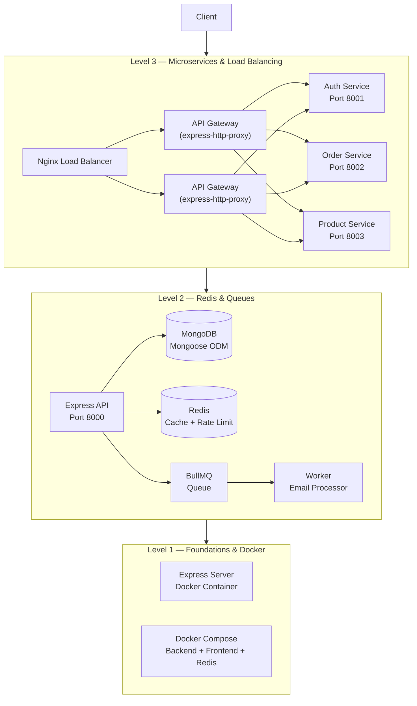
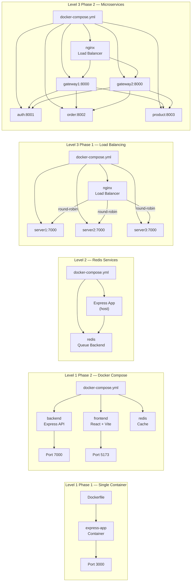
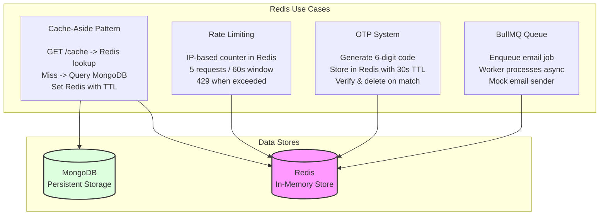
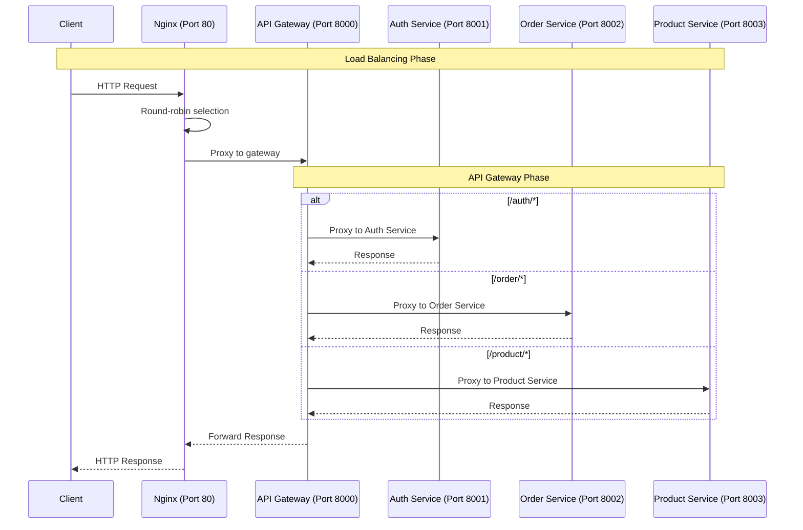

# Advanced Backend Engineering

A **production-grade backend engineering curriculum** that progresses from containerized microservices to distributed systems architecture. This repository demonstrates real-world backend patterns including Docker orchestration, Redis-powered caching & job queues, Nginx load balancing, and an API Gateway microservices decomposition.

---

## Architecture Overview



---

## Levels

### Level 1 — Foundations & Containerization
- **Phase 1:** Dockerize a Node.js/Express server from scratch with Dockerfile best practices
- **Phase 2:** Multi-container orchestration with Docker Compose — backend API, React frontend (Vite), and Redis, all wired together

### Level 2 — Redis, Queues & Background Jobs
- **MongoDB with Mongoose ODM** — schema design, models, and CRUD
- **Redis Caching** — cache-aside pattern for database query optimization
- **BullMQ Job Queue** — async email processing with workers
- **Redis Rate Limiting** — IP-based throttling middleware
- **OTP System** — time-limited OTP generation and verification with Redis

### Level 3 — Distributed Systems & Microservices
- **Phase 1: Nginx Load Balancing** — horizontal scaling with 3 Express server replicas behind a round-robin Nginx reverse proxy
- **Phase 2: Microservices Architecture** — API Gateway pattern with `express-http-proxy` routing to dedicated Auth, Order, and Product services, fronted by Nginx

---

## Docker Architecture

Multi-container orchestration across all levels using Docker and Docker Compose.



---

## Redis Patterns

Redis is used across Level 2 for caching, rate limiting, OTP management, and background job queues.



---

## System Design — Microservices Flow

Request flow through the Level 3 Phase 2 microservices architecture.



---

## Tech Stack

| Category | Technology |
|----------|-----------|
| **Runtime** | Node.js (ES Modules) |
| **Framework** | Express.js 5 |
| **Database** | MongoDB + Mongoose ODM |
| **Caching & Queue** | Redis + BullMQ + ioredis |
| **Containerization** | Docker + Docker Compose |
| **Load Balancing** | Nginx |
| **API Gateway** | express-http-proxy |
| **Frontend** | React 19 + Vite |

---

## Quick Start

### Prerequisites
- Node.js 18+
- Docker & Docker Compose
- MongoDB (local or Atlas)

### Run Each Phase

```bash
# Level 1 — Dockerized Express server
cd level1/phase1/Dockerfilefolder
docker build -t express-app .
docker run -p 3000:3000 express-app

# Level 1 — Full stack with Docker Compose
cd level1/phase2
docker compose up

# Level 2 — Redis, queues, rate limiting
cd level2/phase1
npm install
docker compose up -d    # starts Redis
npm run dev

# Level 3 — Nginx load balancing
cd level3/phase1
docker compose up

# Level 3 — Microservices with API Gateway
cd level3/phase2
docker compose up
```

---

## Project Structure

```
.
├── level1/                   # Foundations
│   ├── phase1/               #   Docker basics
│   └── phase2/               #   Docker Compose (backend + frontend + Redis)
├── level2/                   # Redis, Queues, Middleware
│   └── phase1/               #   Caching, BullMQ, rate limiting, OTP
└── level3/                   # Distributed Systems
    ├── phase1/               #   Nginx load balancing
    └── phase2/               #   Microservices + API Gateway
        └── backend/
            ├── gateway/      #     API Gateway (express-http-proxy)
            └── services/
                ├── auth/     #     Auth microservice
                ├── order/    #     Order microservice
                └── product/  #     Product microservice
```

---

## Key Patterns Demonstrated

- **Containerization:** Multi-stage Dockerfiles, Docker Compose networking
- **Caching Strategy:** Cache-aside (lazy loading) with Redis TTL invalidation
- **Background Jobs:** BullMQ producers and workers for async email processing
- **Rate Limiting:** Sliding window rate limiter using Redis (5 req/min per IP)
- **OTP Workflow:** Time-based OTP generation with 30s expiry and verification
- **Load Balancing:** Nginx upstream with round-robin across stateless replicas
- **API Gateway:** Centralized routing, service abstraction, and proxy forwarding
- **Microservices:** Service decomposition with isolated Docker containers

---

## License

MIT
