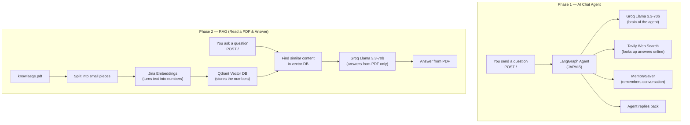
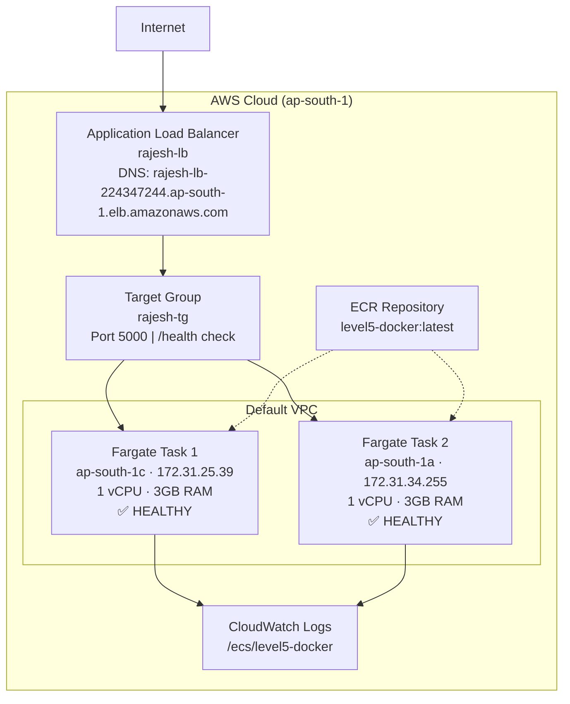

# Advanced Backend Engineering


A complete backend course that takes you from Docker basics all the way to deploying AI-powered apps on AWS. Each level builds on the previous one — start with containers, then add databases and queues, split into microservices, integrate AI models, and finally deploy to the cloud with ECS Fargate.

---

## Topics

`#backend` `#nodejs` `#express` `#docker` `#redis` `#mongodb` `#nginx` `#microservices` `#ai` `#langchain` `#rag` `#aws` `#ecs` `#fargate` `#ecr` `#alb` `#devops` `#cloudformation`

---

## Architecture Diagrams

### Level 4 — AI Integration Flow

How the backend talks to AI models:



### Level 5 — AWS Cloud Deployment Flow

How traffic flows from the internet to your app:



---

## Course Roadmap

### Level 1 — Docker Basics
Start here. Learn to containerize a Node.js app and run multiple services together.

| Phase | What You Learn |
|-------|---------------|
| Phase 1 | Write a Dockerfile, build an image, run a container |
| Phase 2 | Docker Compose — run backend + frontend + Redis together |

### Level 2 — Databases, Caching & Queues
Add real data storage, speed things up with caching, and process background jobs.

| Concept | What It Does |
|---------|-------------|
| MongoDB + Mongoose | Store and retrieve data with schemas |
| Redis Caching | Cache database queries so pages load faster |
| BullMQ Queue | Send emails in the background without blocking |
| Rate Limiting | Stop abuse — max 5 requests per minute per IP |
| OTP System | Generate 6-digit codes that expire in 30 seconds |

### Level 3 — Microservices & Load Balancing
Split a big app into smaller services and distribute traffic.

| Phase | What You Learn |
|-------|---------------|
| Phase 1 | Nginx round-robin across 3 Express server replicas |
| Phase 2 | API Gateway pattern — Auth, Order, and Product services behind Nginx |

### Level 4 — AI Integration

Add artificial intelligence to your backend.

| Phase | What You Build | AI Services Used |
|-------|---------------|------------------|
| **Phase 1 — AI Chat Agent** | A smart assistant (JARVIS) that can chat and search the web | **Groq** (Llama 3.3-70b), **Tavily** (web search), **LangGraph** (agent logic), **MemorySaver** (chat memory) |
| **Phase 2 — RAG System** | Upload a PDF and ask questions about it — the AI only answers from the PDF content | **Groq** (Llama 3.3-70b), **Jina Embeddings** (text → numbers), **Qdrant** (vector database), **pdf-parse** (read PDFs) |

#### Level 4 Setup

```bash
# Phase 1 — AI Agent
cd level4/phase1
npm install
# Add your API keys to .env
npm run dev

# Phase 2 — RAG
cd level4/phase2
npm install
# Add your API keys to .env
# Uncomment upload() in index.js, run once, then comment it back
npm run dev
```

### Level 5 — Cloud Deployment (AWS)

Take your app to the cloud with Docker and AWS.

| Phase | What You Build | Services Used |
|-------|---------------|---------------|
| **Phase 1 — Docker + CI/CD** | Dockerize the app, push to GitHub, auto-deploy to EC2 | Docker, Docker Compose, GitHub Actions, EC2 |
| **Phase 2 — ECS Fargate** | Serverless container orchestration on AWS (live now!) | ECS, Fargate, ECR, ALB, VPC, CloudFormation, CloudWatch |

#### Live Infrastructure (Currently Running)

| Resource | Name | Details |
|----------|------|---------|
| **Cluster** | `excellent-bird-050tm2` | Fargate serverless cluster |
| **Service** | `level5-docker-service-k9t309hl` | 2 tasks running, rolling deployments |
| **Task Definition** | `level5-docker:1` | 1 vCPU · 3GB RAM · port 5000 |
| **Container** | `level5-docker-cont` | Health check: `curl /health` every 30s |
| **Docker Image** | `level5-docker:latest` | Stored in ECR |
| **Load Balancer** | `rajesh-lb` | Internet-facing, HTTP on port 80 |
| **Target Group** | `rajesh-tg` | Routes to port 5000, checks `/health` |
| **VPC** | Default VPC (`vpc-07a5c88c0686b61e5`) | 3 public subnets across ap-south-1a, 1b, 1c |
| **Logs** | CloudWatch `/ecs/level5-docker` | All container logs stream here |
| **Infrastructure** | CloudFormation | 2 stacks: one for cluster, one for service + ALB |

#### Level 5 Setup

```bash
# Phase 1 — Run locally with Docker
cd level5/phase1
docker compose up -d
curl http://localhost:5000/health

# Phase 2 — Already deployed to AWS!
# The app is live behind the ALB.
```

---

## Project Structure

```
.
├── level1/                        # Docker Basics
│   ├── phase1/                    #   Single Docker container
│   └── phase2/                    #   Docker Compose (backend + frontend + Redis)
├── level2/                        # Redis, Queues, Database
│   └── phase1/                    #   MongoDB, caching, BullMQ, rate limiting, OTP
├── level3/                        # Distributed Systems
│   ├── phase1/                    #   Nginx load balancing
│   └── phase2/                    #   Microservices with API Gateway
├── level4/                        # AI Integration
│   ├── phase1/                    #   LangGraph AI Agent (JARVIS)
│   └── phase2/                    #   RAG — ask questions from a PDF
└── level5/                        # Cloud Deployment
    ├── phase1/                    #   Docker + GitHub Actions CI/CD
    └── phase2/                    #   AWS ECS / Fargate (live)
```

---

## Key Concepts Covered

- **Docker** — containerize apps, multi-stage builds, Docker Compose networking
- **Redis** — caching (cache-aside), rate limiting (sliding window), OTP storage, BullMQ queues
- **MongoDB** — Mongoose schemas, models, CRUD operations
- **Nginx** — reverse proxy, round-robin load balancing, upstream configuration
- **Microservices** — service decomposition, API Gateway pattern, express-http-proxy
- **AI Agents** — LangGraph StateGraph, tool-calling, conversational memory with MemorySaver
- **RAG** — PDF parsing, text chunking, embeddings, vector similarity search
- **AWS ECS Fargate** — serverless containers, task definitions, service auto-scaling
- **ALB** — internet-facing load balancer, target groups, health checks
- **CloudFormation** — infrastructure as code, repeatable stack deployments
- **CI/CD** — GitHub Actions automating EC2 deployment on git push

---

## License

MIT

Copyright (c) 2026

Permission is hereby granted, free of charge, to any person obtaining a copy of this software and associated documentation files (the "Software"), to deal in the Software without restriction, including without limitation the rights to use, copy, modify, merge, publish, distribute, sublicense, and/or sell copies of the Software, and to permit persons to whom the Software is furnished to do so, subject to the following conditions:

The above copyright notice and this permission notice shall be included in all copies or substantial portions of the Software.

THE SOFTWARE IS PROVIDED "AS IS", WITHOUT WARRANTY OF ANY KIND, EXPRESS OR IMPLIED, INCLUDING BUT NOT LIMITED TO THE WARRANTIES OF MERCHANTABILITY, FITNESS FOR A PARTICULAR PURPOSE AND NONINFRINGEMENT. IN NO EVENT SHALL THE AUTHORS OR COPYRIGHT HOLDERS BE LIABLE FOR ANY CLAIM, DAMAGES OR OTHER LIABILITY, WHETHER IN AN ACTION OF CONTRACT, TORT OR OTHERWISE, ARISING FROM, OUT OF OR IN CONNECTION WITH THE SOFTWARE OR THE USE OR OTHER DEALINGS IN THE SOFTWARE.
