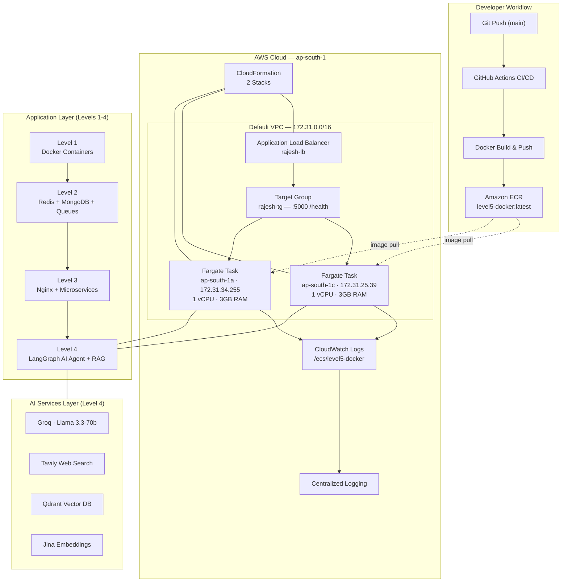

# Advanced Backend Engineering


A progressive backend engineering course that starts with Docker containers and scales all the way to AI-powered microservices deployed on AWS ECS Fargate. Five levels, each building on the last.

---

## Topics

`#backend-engineering` `#nodejs` `#express` `#docker` `#redis` `#mongodb` `#nginx` `#microservices` `#api-gateway` `#langchain` `#langgraph` `#rag` `#ai-agent` `#groq` `#qdrant` `#aws` `#ecs`  `#ecr` `#alb` `#cloudformation` `#github-actions` `#devops` `#cicd` `#system-design`

---

## End-to-End Architecture



---

## Course Levels

| Level | Topic | What You Build |
|-------|-------|---------------|
| [**Level 1**](./level1) | Docker Foundations | Single container → Docker Compose (backend + frontend + Redis) |
| [**Level 2**](./level2) | Redis, MongoDB & Queues | Caching, rate limiting, BullMQ jobs, OTP system |
| [**Level 3**](./level3) | Microservices & Load Balancing | Nginx reverse proxy → API Gateway with Auth/Order/Product services |
| [**Level 4**](./level4) | AI Agents & RAG | LangGraph conversational agent → PDF question-answering |
| [**Level 5**](./level5) | Cloud Deployment (AWS) | Docker CI/CD → Live ECS Fargate cluster with ALB |

---

## Project Structure

```
.
├── level1/              ─── Docker Foundations
│   ├── phase1/              Single container Express app
│   └── phase2/              Docker Compose (backend + frontend + Redis)
├── level2/              ─── Redis, MongoDB & Job Queues
│   └── phase1/              Caching, rate limiting, BullMQ, OTP
├── level3/              ─── Microservices & Load Balancing
│   ├── phase1/              Nginx round-robin with 3 replicas
│   └── phase2/              API Gateway + Auth/Order/Product services
├── level4/              ─── AI Integration
│   ├── phase1/              LangGraph AI Agent (JARVIS)
│   └── phase2/              RAG pipeline over PDF
└── level5/              ─── Cloud Deployment
    ├── phase1/              Docker + GitHub Actions → EC2
    └── phase2/              AWS ECS Fargate (live infrastructure)
```

---

## Key Concepts Covered

| Category | Concepts |
|----------|----------|
| **Containerization** | Dockerfile, multi-stage builds, Docker Compose networking, .dockerignore |
| **Caching** | Redis cache-aside pattern, TTL invalidation, sliding window rate limiter |
| **Databases** | MongoDB + Mongoose ODM, schema design, CRUD, Atlas connection |
| **Background Jobs** | BullMQ producers/workers, async email processing |
| **Security** | OTP generation with Redis expiry, IP-based rate limiting |
| **Load Balancing** | Nginx upstream, round-robin, reverse proxy configuration |
| **Microservices** | Service decomposition, express-http-proxy, API Gateway pattern |
| **AI Agents** | LangGraph StateGraph, tool-calling, MemorySaver conversational memory |
| **RAG** | PDF parsing, text chunking, embeddings, vector similarity search |
| **CI/CD** | GitHub Actions automated deployment, SSH, docker compose |
| **AWS ECS** | Fargate serverless, task definitions, service auto-scaling, ALB target groups |
| **Infrastructure as Code** | CloudFormation stack management, repeatable deployments |
| **Observability** | CloudWatch Logs, container health checks, ALB health monitoring |
| **High Availability** | Multi-AZ deployment, rolling updates, deployment circuit breaker |

---

## Quick Start

```bash
# Level 1 — Single Docker container
cd level1/phase1/Dockerfilefolder
docker build -t express-app .
docker run -p 3000:3000 express-app

# Level 1 — Full stack with Docker Compose
cd level1/phase2
docker compose up

# Level 2 — Redis, MongoDB, queues
cd level2/phase1
npm install
docker compose up -d    # starts Redis
# Set up MongoDB Atlas (see .env.example)
npm run dev

# Level 3 — Nginx load balancing
cd level3/phase1
docker compose up

# Level 3 — Microservices with API Gateway
cd level3/phase2
docker compose up

# Level 4 — AI Agent
cd level4/phase1
npm install
# Add API keys to .env
npm run dev

# Level 4 — RAG
cd level4/phase2
npm install
# Add API keys to .env
# Uncomment upload() in index.js, run once, re-comment
npm run dev

# Level 5 — Docker locally
cd level5/phase1
docker compose up -d
curl http://localhost:5000/health
```

---

## License

MIT

Copyright (c) 2026

Permission is hereby granted, free of charge, to any person obtaining a copy of this software and associated documentation files (the "Software"), to deal in the Software without restriction, including without limitation the rights to use, copy, modify, merge, publish, distribute, sublicense, and/or sell copies of the Software, and to permit persons to whom the Software is furnished to do so, subject to the following conditions:

The above copyright notice and this permission notice shall be included in all copies or substantial portions of the Software.

THE SOFTWARE IS PROVIDED "AS IS", WITHOUT WARRANTY OF ANY KIND, EXPRESS OR IMPLIED, INCLUDING BUT NOT LIMITED TO THE WARRANTIES OF MERCHANTABILITY, FITNESS FOR A PARTICULAR PURPOSE AND NONINFRINGEMENT. IN NO EVENT SHALL THE AUTHORS OR COPYRIGHT HOLDERS BE LIABLE FOR ANY CLAIM, DAMAGES OR OTHER LIABILITY, WHETHER IN AN ACTION OF CONTRACT, TORT OR OTHERWISE, ARISING FROM, OUT OF OR IN CONNECTION WITH THE SOFTWARE OR THE USE OR OTHER DEALINGS IN THE SOFTWARE.
