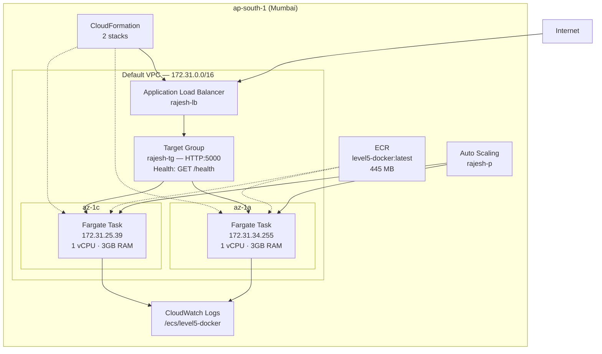

# AWS ECS Fargate Deployment

Live infrastructure running a containerized Express app on AWS ECS with Fargate, fronted by an Application Load Balancer across multiple availability zones.

---

## Architecture

---

## Resource Overview

| Category | Resource | Name / ID |
|----------|----------|-----------|
| **VPC** | Default VPC | `vpc-07a5c88c0686b61e5` — 172.31.0.0/16 |
| | Subnet az-1a | `subnet-0f4d1327d7bdc4cfb` (172.31.32.0/20) |
| | Subnet az-1b | `subnet-07333f8593a83b590` (172.31.0.0/20) |
| | Subnet az-1c | `subnet-078c456e5f452b659` (172.31.16.0/20) |
| | Security Group | `sg-01ada73101ff62b1e` |
| **ALB** | Load Balancer | `rajesh-lb` — internet-facing, HTTP:80 |
| | Target Group | `rajesh-tg` — IP targets, HTTP:5000, /health |
| **ECS** | Cluster | `excellent-bird-050tm2` |
| | Service | `level5-docker-service-k9t309hl` |
| | Task Definition | `level5-docker:1` — 1024 CPU · 3072 MB |
| | Container | `level5-docker-cont` — port 5000 |
| | Running Tasks | 2 (both HEALTHY) |
| **ECR** | Repository | `level5-docker` — latest tag, 445 MB |
| **Logging** | Log Group | `/ecs/level5-docker` — awslogs driver |
| **IAM** | Execution Role | `ecsTaskExecutionRole` |
| **Auto Scaling** | Policy | `rajesh-p` — target tracking |

---

## Cluster Details

| Property | Value |
|----------|-------|
| Cluster Name | `excellent-bird-050tm2` |
| Status | ACTIVE |
| Capacity Providers | FARGATE, FARGATE_SPOT |
| Running Tasks | 2 |
| Active Services | 1 |
| Region | ap-south-1 (Mumbai) |

## Service Details

| Property | Value |
|----------|-------|
| Service Name | `level5-docker-service-k9t309hl` |
| Status | ACTIVE |
| Desired Count | 2 |
| Running Count | 2 |
| Launch Type | FARGATE |
| Platform Version | 1.4.0 |
| Deployment Type | Rolling update |
| Circuit Breaker | Enabled (rollback on failure) |
| AZ Rebalancing | Enabled |

## Task Definition

| Property | Value |
|----------|-------|
| Family | `level5-docker` |
| Revision | 1 |
| CPU | 1024 (1 vCPU) |
| Memory | 3072 MB (3 GB) |
| Network Mode | awsvpc |
| OS / Arch | Linux / X86_64 |
| Ephemeral Storage | 20 GB |

## Container Configuration

| Property | Value |
|----------|-------|
| Name | `level5-docker-cont` |
| Image | `160489847268.dkr.ecr.ap-south-1.amazonaws.com/level5-docker` |
| Port | 5000 (HTTP) |
| Health Check | `CMD-SHELL curl -f http://localhost:5000/health` |
| Interval | 30s |
| Timeout | 5s |
| Retries | 3 |
| Log Driver | awslogs → `/ecs/level5-docker` |

## Load Balancer

| Property | Value |
|----------|-------|
| Name | `rajesh-lb` |
| DNS | `rajesh-lb-224347244.ap-south-1.elb.amazonaws.com` |
| Scheme | internet-facing |
| Type | application |
| State | active |
| Listener | HTTP:80 |
| Target Group | `rajesh-tg` |
| Target Type | IP |
| Health Check Path | `/health` |
| Healthy Threshold | 5 |
| Unhealthy Threshold | 2 |

## Active Tasks

| Task ID | AZ | Private IP | Status | Health |
|---------|----|-----------|--------|--------|
| `c1382055…` | ap-south-1a | 172.31.34.255 | RUNNING | HEALTHY |
| `a984aa30…` | ap-south-1c | 172.31.25.39 | RUNNING | HEALTHY |

---

## AWS Account Resource Inventory (ap-south-1)

| Service | Resource Count |
|---------|---------------|
| EC2 (VPC, subnets, ENIs, SGs) | 24 |
| ECS (cluster, service, tasks) | 4 |
| ELB (ALB, TG, listener) | 3 |
| CloudFormation (stacks) | 3 (2 active, 1 failed) |
| CloudWatch (alarms + log group) | 3 |
| Athena | 2 |
| ECR (repository) | 1 |
| S3 (bucket) | 1 |
| EventBridge (event bus) | 1 |
| X-Ray (sampling rule) | 1 |
| ElastiCache (user) | 1 |
| Resource Explorer (index + view) | 2 |

---

## Deployment Strategy

1. Push image to ECR (`level5-docker:latest`)
2. CloudFormation manages the cluster and service stacks
3. ECS pulls the image and starts Fargate tasks
4. ALB target group registers task IPs and runs health checks
5. Rolling update replaces tasks with zero downtime (max 200%, min 100%)
6. Circuit breaker rolls back automatically if deployment fails
7. AZ rebalancing keeps tasks spread across availability zones

---

## Key Learnings

- **Fargate** — no servers to manage; just define CPU/memory and run
- **awsvpc mode** — each task gets its own ENI and private IP
- **Health checks** — container-level (curl) + ALB-level (target group) for self-healing
- **Rolling deployments** — circuit breaker prevents bad deploys from taking down the service
- **CloudFormation** — repeatable infrastructure; cluster and service defined as stacks
- **CloudWatch Logs** — all container stdout streams to `/ecs/level5-docker`
