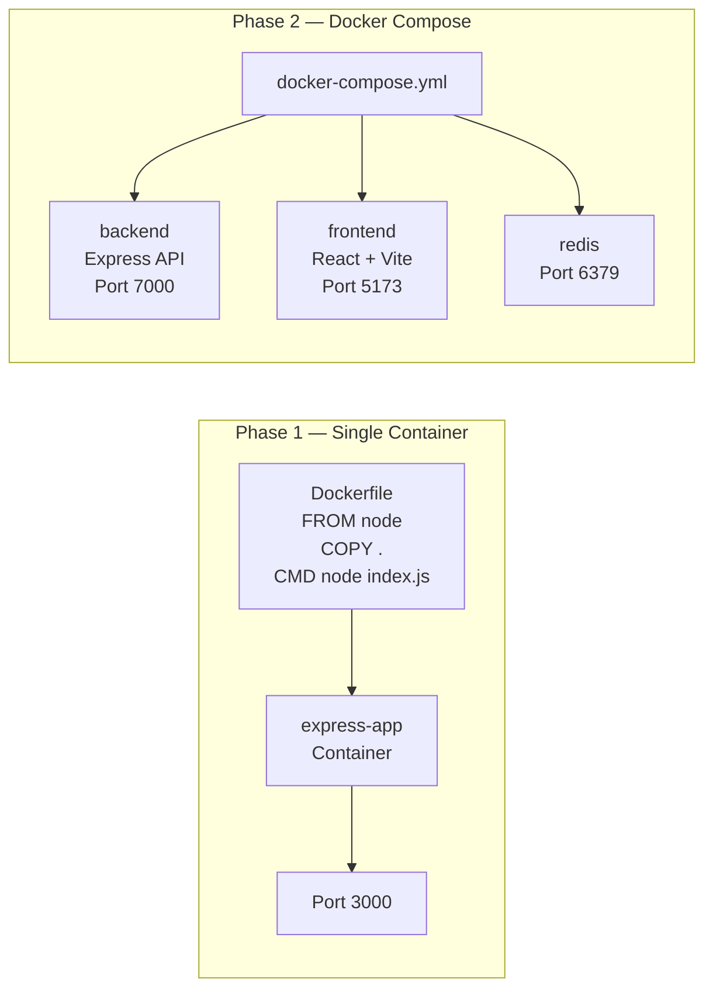

# Level 1 — Docker Foundations


The starting point. Learn to containerize a Node.js Express server and run multi-service architectures with Docker Compose.

---

## Core Focus & Objectives

- Write a production-ready `Dockerfile` from scratch
- Understand image layers, caching, and `.dockerignore`
- Orchestrate multiple containers with `docker-compose.yml`
- Wire a backend API, React frontend, and Redis together in one network

---

## Architecture



---

## Files Explained

### Phase 1 — Single Docker Container (`phase1/Dockerfilefolder`)

| File | Purpose |
|------|---------|
| `Dockerfile` | Builds a Node.js image, installs deps, runs `index.js` on port 6000 |
| `.dockerignore` | Excludes `Dockerfile` and `node_modules` from the build context |
| `index.js` | Minimal Express server with a `GET /` route returning "Hello World" |
| `package.json` | Project manifest — Express 5 + dotenv as dependencies |
| `db.js` | Placeholder for future database connection logic |
| `socket.js` | Placeholder for future WebSocket logic |
| `models/` | Empty directory for future Mongoose models |

### Phase 2 — Multi-Container Setup (`phase2`)

| File | Purpose |
|------|---------|
| `docker-compose.yml` | Defines 3 services: `backend`, `frontend`, and `redis` with port mappings |
| `backend/Dockerfile` | Same pattern as Phase 1 — Express server on port 7000 |
| `backend/index.js` | Express server returning "Hello World" on `GET /` |
| `backend/.env` | Stores `PORT=7000` |
| `frontend/Dockerfile` | Vite dev server with `--host 0.0.0.0` for container accessibility |
| `frontend/package.json` | React 19 + Vite 8 |
| `frontend/vite.config.js` | Standard Vite config with React plugin |
| `frontend/src/App.jsx` | Main React component |

---

## How to Run

```bash
# Phase 1 — Build and run a single container
cd phase1/Dockerfilefolder
docker build -t express-app .
docker run -p 3000:6000 express-app
# Visit http://localhost:3000

# Phase 2 — Spin up all services together
cd ../phase2
docker compose up
# Backend: http://localhost:8000
# Frontend: http://localhost:5173
# Redis: localhost:6379
```
