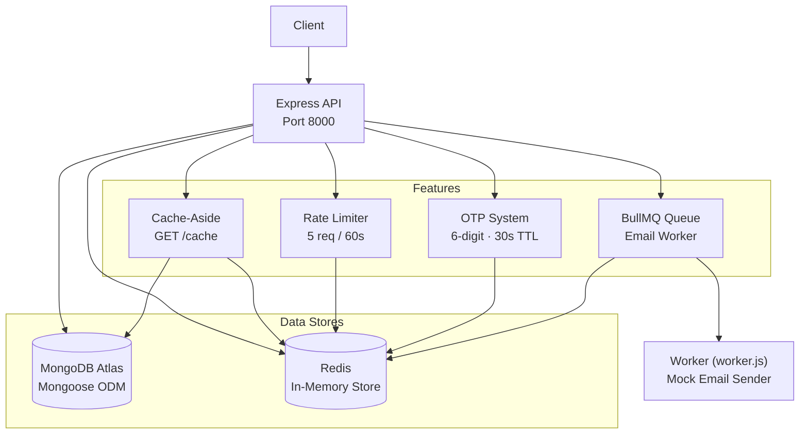

# Level 2 — Redis, MongoDB & Job Queues


Add real persistence, in-memory caching, background job processing, and security controls to your Express API.

---

## Core Focus & Objectives

- Connect and model data with **MongoDB + Mongoose ODM**
- Implement **Redis cache-aside** pattern to speed up database reads
- Build a **BullMQ job queue** for async email processing
- Add **IP-based rate limiting** using Redis counters
- Create a **time-limited OTP system** with automatic expiry

---

## Architecture



---

## Files Explained

### Core Application (`phase1/`)

| File | Purpose |
|------|---------|
| `index.js` | Main Express server — routes for create, get, cache, OTP. Connects MongoDB + Redis |
| `worker.js` | BullMQ Worker — listens for email jobs and processes them asynchronously |
| `queue.js` | BullMQ Queue definition — creates the `emailQueue` with Redis connection |
| `package.json` | Dependencies: Express 5, Mongoose 9, BullMQ, ioredis, dotenv |
| `.env` | Environment: `PORT`, `MONGODB_URI` (Atlas), `REDIS_URL` |
| `.env.example` | Template with placeholder values |

### Library (`phase1/lib/`)

| File | Purpose |
|------|---------|
| `db.js` | Mongoose connection helper — connects to MongoDB Atlas on startup |
| `sendEmail.js` | Mock email sender — simulates a 5-second email send with a console log |

### Middleware (`phase1/middleware/`)

| File | Purpose |
|------|---------|
| `ratelimit.js` | Redis-based IP rate limiter — max 5 requests per 60-second window, returns 429 when exceeded |

### Models (`phase1/models/`)

| File | Purpose |
|------|---------|
| `user.model.js` | Mongoose User schema — `name`, `email`, `password` with timestamps |

### Docker (`phase1/`)

| File | Purpose |
|------|---------|
| `docker-compose.yml` | (located in parent `level2/`) Starts a Redis container on port 6379 |

---

## API Endpoints

| Method | Route | Description |
|--------|-------|-------------|
| `GET` | `/` | Health check |
| `POST` | `/create` | Create a user + enqueue email job |
| `GET` | `/get` | Fetch all users (rate limited) |
| `GET` | `/cache` | Fetch users with Redis cache-aside |
| `POST` | `/send-otp` | Generate 6-digit OTP (30s expiry) |
| `POST` | `/verify-otp` | Verify OTP and delete from Redis |

---

## How to Run

```bash
cd phase1
npm install
# Set up MongoDB Atlas and update .env
docker compose up -d      # starts Redis on :6379
npm run dev               # starts Express on :8000

# In a separate terminal, start the worker:
node worker.js
```
