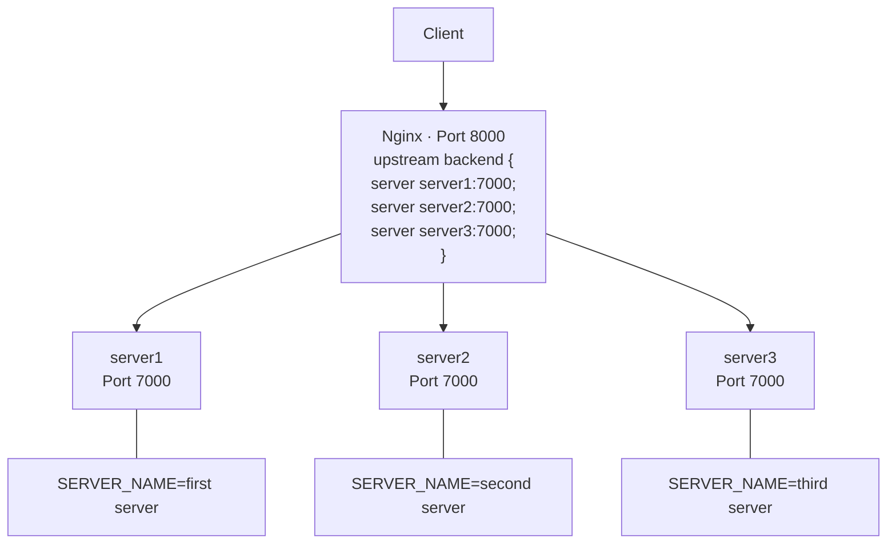
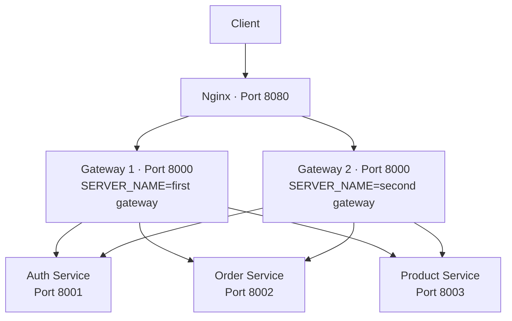

# Level 3 — Microservices & Load Balancing


Scale horizontally with Nginx load balancing and decompose into microservices with an API Gateway pattern.

---

## Core Focus & Objectives

- Configure **Nginx as a reverse proxy** with round-robin load balancing
- Run **3 stateless Express replicas** behind a single entry point
- Implement the **API Gateway pattern** using `express-http-proxy`
- Decompose a monolith into **Auth, Order, and Product microservices**
- Front multiple gateways with Nginx for high availability

---

## Architecture

### Phase 1 — Load Balancing



### Phase 2 — API Gateway + Microservices



---

## Files Explained

### Phase 1 — Nginx Load Balancing (`phase1/`)

| File | Purpose |
|------|---------|
| `docker-compose.yml` | Defines Nginx + 3 Express server replicas with environment variables |
| `nginx/nginx.conf` | Upstream block with 3 servers, round-robin, reverse proxy to backend |
| `server/Dockerfile` | Standard Node.js Dockerfile |
| `server/index.js` | Express server returning server name on each request |
| `server/package.json` | Express 5, Mongoose, BullMQ, ioredis |
| `server/.env` | MongoDB Atlas URI and Redis URL |

### Phase 2 — Microservices (`phase2/`)

| File | Purpose |
|------|---------|
| `docker-compose.yml` | 6 services: Nginx, 2 Gateways, Auth, Order, Product |
| `nginx/nginx.conf` | Upstream with 2 gateway servers, proxy to `gateway1:8000`, `gateway2:8000` |
| `backend/gateway/index.js` | Express server with `express-http-proxy` — routes `/auth`, `/order`, `/product` to respective services |
| `backend/gateway/Dockerfile` | Standard Node.js Dockerfile |
| `backend/gateway/package.json` | Express 5 + `express-http-proxy` |
| `backend/services/auth/index.js` | Auth microservice — `GET /` returns "Hello From Auth Service" |
| `backend/services/order/index.js` | Order microservice — `GET /` returns "Hello From Order Service" |
| `backend/services/product/index.js` | Product microservice — `GET /` returns "Hello From Product Service" |
| Each service has: `Dockerfile`, `package.json`, `.env` | Follows the same standardized template |

---

## API Endpoints

### Phase 1
| Method | Route | Response |
|--------|-------|----------|
| `GET` | `/` | Hello message + server name |
| `POST` | `/create` | Creates user + returns server name |
| `GET` | `/get` | Returns server name |

### Phase 2
| Method | Route | Proxied To |
|--------|-------|------------|
| `GET` | `/` | Gateway home |
| `GET` | `/auth` | Auth Service :8001 |
| `GET` | `/order` | Order Service :8002 |
| `GET` | `/product` | Product Service :8003 |

---

## How to Run

```bash
# Phase 1 — Load balancing
cd phase1
docker compose up
# Nginx on http://localhost:8000 — refresh to see round-robin

# Phase 2 — Microservices
cd phase2
docker compose up
# Nginx on http://localhost:8080
# Try /auth, /order, /product routes
```
