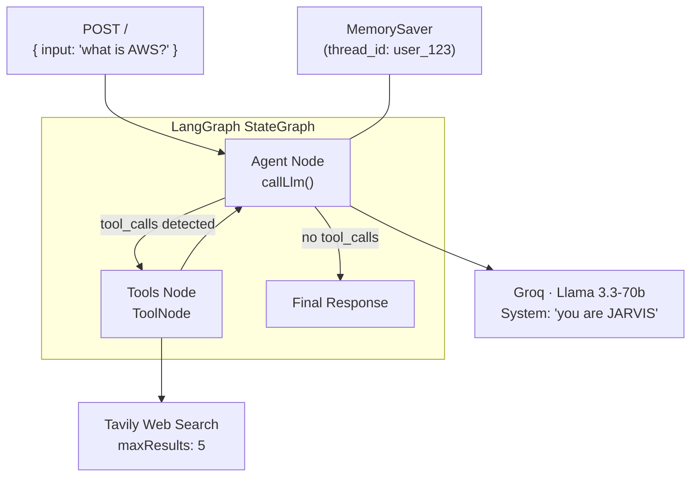
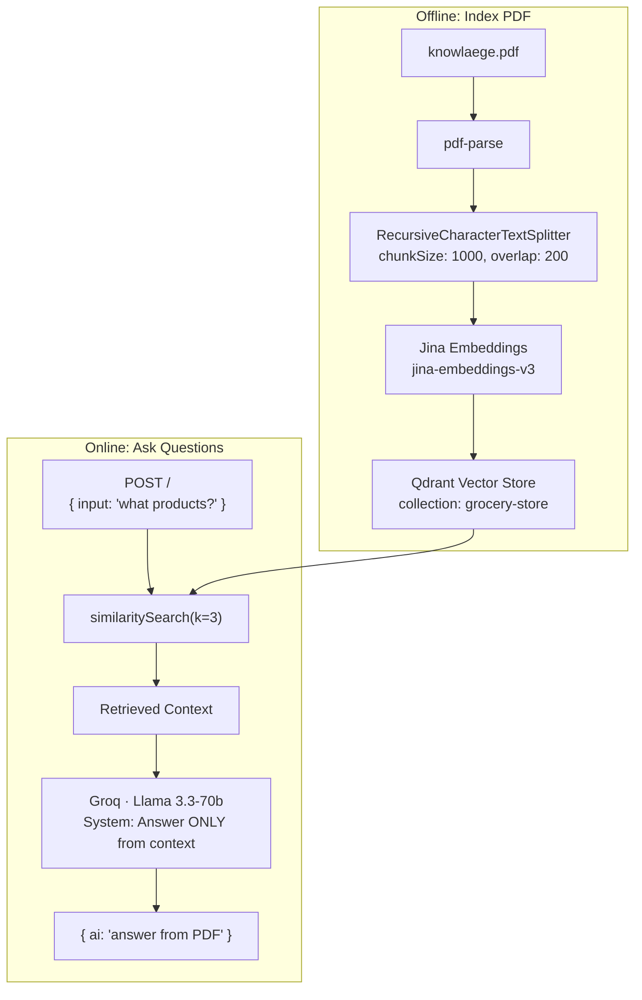

# Level 4 — AI Integration


Add artificial intelligence to your backend. Build a conversational AI agent with LangGraph, then implement a RAG (Retrieval-Augmented Generation) pipeline that answers questions from PDF content.

---

## Core Focus & Objectives

- Build a **stateful AI agent** using LangGraph's `StateGraph` with tool-calling abilities
- Integrate **Groq's Llama 3.3-70b** as the LLM provider
- Add **Tavily web search** as a tool the agent can call autonomously
- Implement **conversational memory** with LangGraph's `MemorySaver`
- Build a **RAG pipeline**: parse PDF → chunk → embed → store in Qdrant → retrieve → answer
- Use **Jina Embeddings** to convert text chunks into vector embeddings
- Use **Qdrant** as a cloud-hosted vector database for similarity search

---

## Architecture

### Phase 1 — LangGraph AI Agent (JARVIS)



### Phase 2 — RAG Pipeline



---

## Files Explained

### Phase 1 — AI Agent (`phase1/`)

| File | Purpose |
|------|---------|
| `index.js` | Express server with LangGraph agent. Defines StateGraph, Tavily tool, Groq LLM, MemorySaver, and a `POST /` endpoint |
| `package.json` | Dependencies: `@langchain/langgraph`, `@langchain/groq`, `@langchain/tavily`, `@langchain/core`, Express 5 |
| `.env` | API keys for TAVILY, GOOGLE, GROQ, and PORT |
| `lang-graph.png` | Visual diagram of the LangGraph workflow |

**Key Code Concepts in `index.js`:**

```
StateGraph(MessagesAnnotation)  →  defines the agent's state machine
  .addNode("agent", callLlm)    →  the LLM processing node
  .addNode("tools", toolNode)   →  the tool execution node
  .addConditionalEdges("agent", shouldContinue)  →  decides: call tools or end?
  .compile({ checkpointer })    →  compiles with memory persistence

The agent:
  1. Receives user input via POST /
  2. LLM decides if it needs to search the web
  3. If yes → TavilySearch tool → back to LLM
  4. If no  → returns final answer
  5. MemorySaver preserves conversation history
```

### Phase 2 — RAG (`phase2/`)

| File | Purpose |
|------|---------|
| `index.js` | Express server with RAG pipeline. Reads PDF, chunks, embeds, stores, and answers questions |
| `package.json` | Dependencies: `@langchain/qdrant`, `@langchain/community` (Jina), `@langchain/textsplitters`, `pdf-parse`, Express 5 |
| `.env` | API keys for GROQ, GOOGLE, QDRANT, JINA, and PORT |
| `knowlaege.pdf` | The PDF document used as the knowledge source |

**Key Code Concepts in `index.js`:**

```
// Indexing (run once):
upload():
  1. Read PDF with pdf-parse
  2. Split text with RecursiveCharacterTextSplitter (1000 chars, 200 overlap)
  3. Create embeddings with JinaEmbeddings
  4. Store in QdrantVectorStore (collection: "grocery-store")

// Querying (always on):
POST /:
  1. similaritySearch(input, 3)  →  finds 3 most relevant chunks
  2. Join chunks as context
  3. LLM generates answer STRICTLY from context
  4. Returns { ai: "answer from PDF" }
```

---

## Setup

```bash
# Phase 1 — AI Agent
cd phase1
npm install
# Edit .env with your API keys
npm run dev

# Phase 2 — RAG Pipeline
cd phase2
npm install
# Edit .env with your API keys
# Uncomment upload() in index.js, run once, then comment it back
npm run dev
```

### API Keys Needed

| Service | Phase | Get Keys At |
|---------|-------|-------------|
| **Groq** | Both | https://console.groq.com |
| **Tavily** | Phase 1 | https://tavily.com |
| **Jina** | Phase 2 | https://jina.ai |
| **Qdrant** | Phase 2 | https://qdrant.tech (cloud cluster) |
