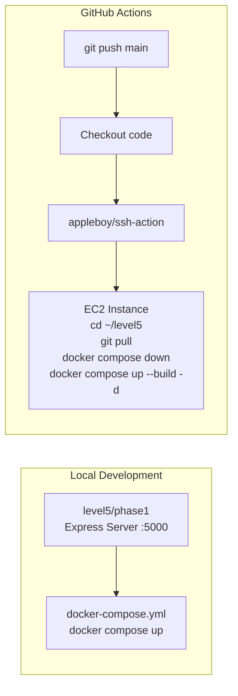
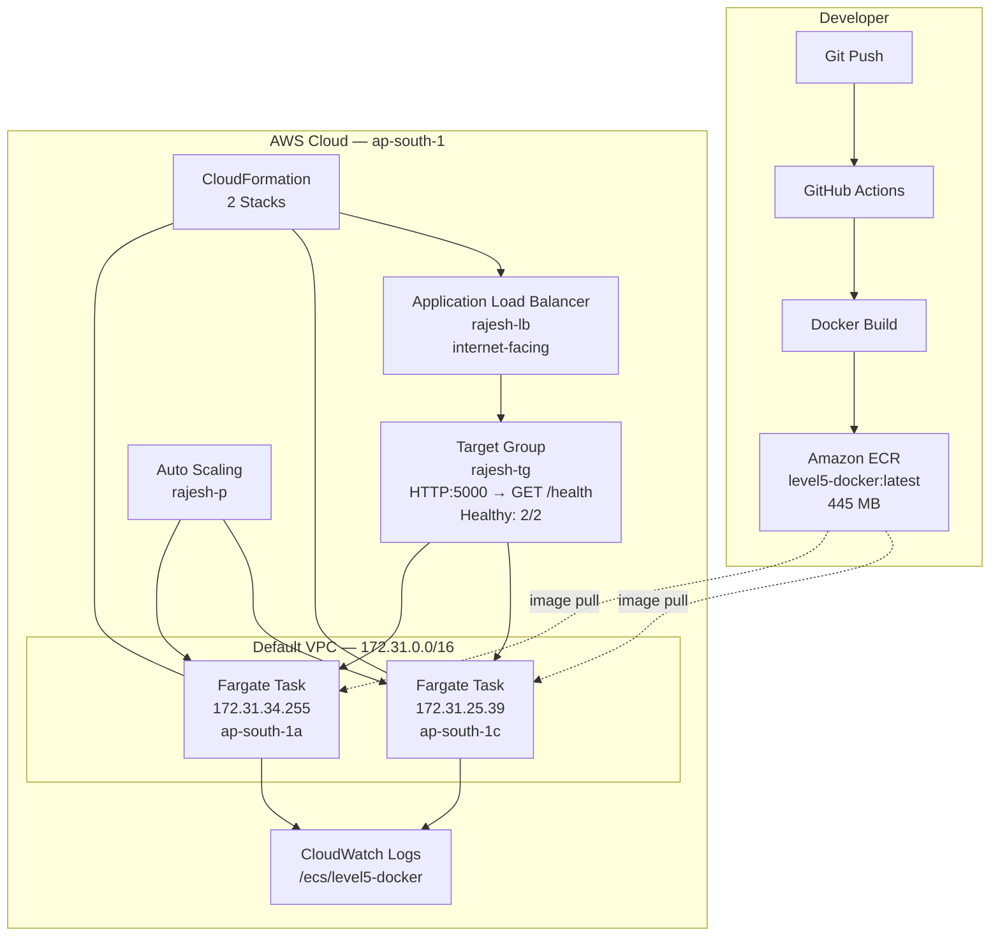

# Level 5 — Cloud Deployment (AWS)


Deploy your first containerized app to the cloud. Start with a Docker + GitHub Actions CI/CD pipeline to EC2, then go serverless with AWS ECS Fargate fronted by an Application Load Balancer.

---

## Core Focus & Objectives

- Containerize a Node.js Express app with **Docker and Docker Compose**
- Automate deployment with **GitHub Actions** (push → build → SSH → deploy)
- Understand **AWS ECS Fargate** — serverless containers without managing servers
- Configure an **Application Load Balancer** with health checks and target groups
- Implement **rolling deployments** with a **circuit breaker** for zero-downtime updates
- Use **CloudFormation** for infrastructure as code
- Enable **CloudWatch Logs** for centralized container logging

---

## Architecture

### Phase 1 — Local Docker + CI/CD



### Phase 2 — AWS ECS Fargate (Live Infrastructure)



---

## Live Infrastructure

| Resource | Name | Details |
|----------|------|---------|
| **Cluster** | `excellent-bird-050tm2` | Fargate, 2 running tasks, 1 active service |
| **Service** | `level5-docker-service-k9t309hl` | Rolling deploy, circuit breaker enabled, AZ rebalancing on |
| **Task Definition** | `level5-docker:1` | 1 vCPU · 3072 MB RAM · awsvpc · Linux/X86_64 |
| **Container** | `level5-docker-cont` | Port 5000 · Health: `CMD-SHELL curl -f http://localhost:5000/health \|\| exit 1` · Interval: 30s |
| **ECR Image** | `level5-docker:latest` | 445 MB · sha256:859c2eae... |
| **Load Balancer** | `rajesh-lb` | internet-facing · HTTP:80 · DNS: `rajesh-lb-224347244.ap-south-1.elb.amazonaws.com` |
| **Target Group** | `rajesh-tg` | IP targets · HTTP:5000 · Health: `GET /health` · Threshold: 5 healthy / 2 unhealthy |
| **VPC** | `vpc-07a5c88c0686b61e5` | Default · 172.31.0.0/16 · 3 public subnets (a, b, c) |
| **Security Group** | `sg-01ada73101ff62b1e` | ALB inbound on port 80 |
| **Logging** | CloudWatch Log Group | `/ecs/level5-docker` · awslogs driver |
| **Auto Scaling** | `rajesh-p` | ECS Service Auto Scaling |
| **CloudFormation** | 2 stacks | Cluster infra stack + Service/ALB stack |

### Active Tasks

| Task ID | AZ | Private IP | Status | Health |
|---------|----|-----------|--------|--------|
| `c1382055…` | ap-south-1a | 172.31.34.255 | RUNNING | HEALTHY |
| `a984aa30…` | ap-south-1c | 172.31.25.39 | RUNNING | HEALTHY |

### Deployment Configuration

| Setting | Value |
|---------|-------|
| Deployment Type | Rolling update |
| Maximum Percent | 200% |
| Minimum Healthy Percent | 100% |
| Circuit Breaker | Enabled (automatic rollback) |
| Platform Version | 1.4.0 |

---

## Files Explained

### Phase 1 — Docker + CI/CD (`phase1/`)

| File | Purpose |
|------|---------|
| `index.js` | Express server with two routes: `GET /` ("Hello from CI/CD") and `GET /health` ("all good") |
| `Dockerfile` | Node.js image, copies source, runs `node index.js` |
| `docker-compose.yml` | Single service `level5` mapping port 5000:5000 |
| `.github/workflows/deploy.yml` | GitHub Actions workflow — on push to `main`, SSH into EC2, git pull, rebuild containers |
| `package.json` | Express 5 + dotenv |
| `.dockerignore` | Excludes `Dockerfile` and `node_modules` |
| `.gitignore` | Standard Node.js gitignore |

### Phase 2 — ECS Fargate (`phase2/`)

| File | Purpose |
|------|---------|
| `index.js` | Express server — `GET /` returns "Hello Rajesh v5..", `GET /health` for ALB health checks |
| `Dockerfile` | Same pattern as Phase 1 — the image deployed to ECR |
| `package.json` | Express 5 + dotenv |
| `.dockerignore` | Excludes `Dockerfile` and `node_modules` |

---

## How to Run

```bash
# Phase 1 — Run locally with Docker Compose
cd phase1
docker compose up -d
curl http://localhost:5000/health
curl http://localhost:5000/

# Phase 1 — Deploy via CI/CD
# Push to main branch → GitHub Actions automatically deploys to EC2

# Phase 2 — Already deployed to AWS!
# Access the app via the ALB:
curl http://rajesh-lb-224347244.ap-south-1.elb.amazonaws.com/
curl http://rajesh-lb-224347244.ap-south-1.elb.amazonaws.com/health
```
