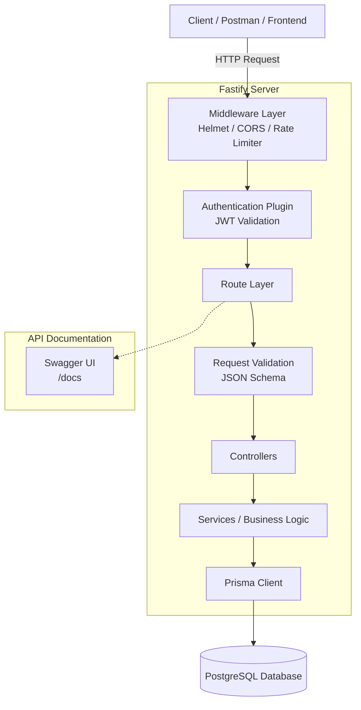

# Fastify Task API

A RESTful Task Management API built with **Fastify**, **Prisma ORM**, **PostgreSQL**, and **JWT Authentication**.

This project demonstrates a clean backend architecture with user authentication, protected routes, and task management.

---

## Tech Stack

| Category           | Technology                                      |
| ------------------ | ----------------------------------------------- |
| **Runtime**        | Node.js                                         |
| **Framework**      | Fastify                                         |
| **ORM**            | Prisma                                          |
| **Database**       | PostgreSQL                                      |
| **Auth**           | JWT (Access + Refresh Tokens)                   |
| **Password Hash**  | Bcrypt                                          |
| **API Docs**       | Swagger (via `@fastify/swagger`)                |
| **Security**       | Helmet, CORS, Rate Limiting, JSON Schema Validation |

---

## Architecture



---

## Features

### Authentication

- User Registration
- User Login
- JWT Access Token
- Refresh Token Rotation
- Logout
- Protected Routes

### Task Management

- Create Task
- Get All Tasks
- Get Task By ID
- Update Task
- Delete Task
- Search Tasks
- Pagination

### Security

- Password Hashing with Bcrypt
- JWT Authentication
- CORS
- Helmet
- Rate Limiting
- Request Validation using Fastify JSON Schema

---

## Project Structure

```text
src/
├── config/        # Configuration (env, db, jwt)
├── controllers/   # Route handlers
├── plugins/       # Fastify plugins (auth, swagger, etc.)
├── routes/        # Route definitions
├── schemas/       # JSON Schema validation
├── services/      # Business logic
├── app.js         # App setup & plugin registration
└── server.js      # Entry point
```

---

## Installation

Clone the repository.

```bash
git clone <repository-url>
```

Go to the project directory.

```bash
cd task-api
```

Install dependencies.

```bash
npm install
```

---

## Environment Variables

Create a `.env` file in the project root.

```env
PORT=3000

DATABASE_URL="your_postgresql_database_url"

JWT_SECRET="your_secret_key"
```

---

## Database

Run Prisma migration.

```bash
npx prisma migrate dev
```

Generate Prisma Client.

```bash
npx prisma generate
```

---

## Run the Project

**Development**

```bash
npm run dev
```

---

## API Documentation

Swagger UI is available at:

```
http://localhost:3000/docs
```

---

## Main API Endpoints

### Authentication

| Method | Endpoint          |
| ------ | ----------------- |
| POST   | /auth/register    |
| POST   | /auth/login       |
| POST   | /auth/refresh     |
| POST   | /auth/logout      |

### Users

| Method | Endpoint        |
| ------ | --------------- |
| GET    | /users/profile  |

### Tasks

| Method | Endpoint          |
| ------ | ----------------- |
| POST   | /tasks            |
| GET    | /tasks            |
| GET    | /tasks/:id        |
| PATCH  | /tasks/:id        |
| DELETE  | /tasks/:id        |
| GET    | /tasks/search     |
| GET    | /tasks/pagination |

---

## Learning Goals

This project helped me learn:

- Fastify Plugin Architecture
- REST API Development
- Prisma ORM
- PostgreSQL
- JWT Authentication
- Request Validation
- Error Handling
- Backend Project Structure
- API Documentation with Swagger

---

## License

This project is for learning and portfolio purposes.
